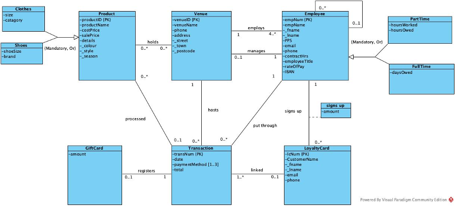

# Enterprise Database within a Retail Business

## 1. System Description

### 1.1. Description of the business
This is a design document of an enterprise database for a retail business. This database will be used to log sales/transaction details, hold customer information through an optional loyalty card scheme, keep track of stock quantities within each venue, keep employee details for payroll and holiday pay, and to measure KPIs within the business (e.g. sale/transaction amounts, loyalty and gift cards sold). This business has multiple venues around Ireland, which will all be using this database. This retail shop sells products (e.g. clothes, shoes, accessories).

### 1.2. Objects of interest
Transaction: are defined by an individual transaction number (transNum). They hold the date, total and payment method. A transaction can only be put through by one employee after logging into the till with their employee number (a transaction can only be created by an employee), an employee can put through zero to many transactions. A transaction can process zero to many products, a product can be processed by zero or only one transaction. A transaction can be hosted at only one venue but a venue can host zero to multiple transactions.
• [Multivariable attribute] Payment method: A transaction can be paid in multiple ways, including cash, card, gift card, or a mix of these.
Loyalty card: loyalty cards have a loyalty card number (lcNum). They hold the customer name (first and last), their email and phone number. Loyalty cards are linked to transactions, a loyalty card can be linked to one to many transactions (loyalty card are only offered with a purchase), a transaction can only be linked to zero to one loyalty card (customers do not have to sign up for a loyalty card, hence not every transaction can be linked to a loyalty card). An employee signs up a loyalty card, an employee can sign up zero to many loyalty cards but a card can only be signed up by one employee. The amount of loyalty cards an employee signs up is recorded as a measured KPI of their performance.
Employees: employees have an employee number (empNum). They also have name (first and last), PPS, email, phone, contract hours (full time 38hrs, part time 20hrs or 10hrs), employee title (sales assistant, supervisor, manager), rate of pay and IBAN.
• [Recursive relationship] Managers and Staff: mangers manage staff within a venue. A manger can manage zero to many staff, staff can only be managed by one manager. A manager can manage to zero to one venue, a venue must have one manager. Staff are employed by one venue and a venue must employ four to many staff.
• [Supertype and subtype] Part time and full time holidays: full time holidays and part time holidays are recorded separately. For part time employees paid on the hour they record the hours worked and holiday hours owed (each 8 hours worked means one hour holiday pay). For the full time employees they record the their holiday days owed (full time get 23 holiday days withing the year). These must be recorded 2 separately as full time can only take holiday days whereas part time work up holiday hours.
Venue: venues are defined by the venue ID, venue name, phone, address (street, town, postcode).
Products: products are defined by the product ID. They are divided into product name, product category, cost price, sale price, colour, style, season. A product can be held at zero to many venues, a venue can hold zero to many products.
• [Supertype and subtype] Clothes and Shoes: a product can be either a clothes item or a pair of shoes. They are treated separately as the sizing for both are different, shoes sold are different brands, clothes can be a different category (e.g. top, dress, pants).
Gift card: [weak entity] gift cards are defined by the gift card number (gcNum) and amount. A gift card is registered by one transaction, a transaction can register zero to one gift cards. Gift card must be their own entity because they cannot be related to any other entity besides transactions. They’re different from a product as they do not act in the same way. They add profit to the till without the loss of a product/stock. However their amount can be used towards a future transaction without adding profit to the till.
3

## 2. Enhanced ER Diagram

